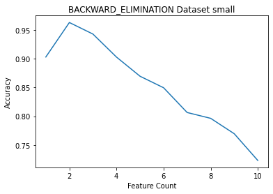
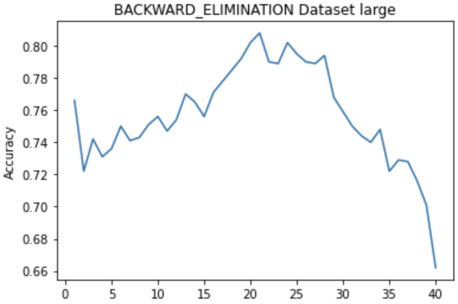
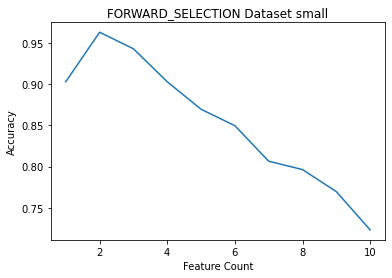
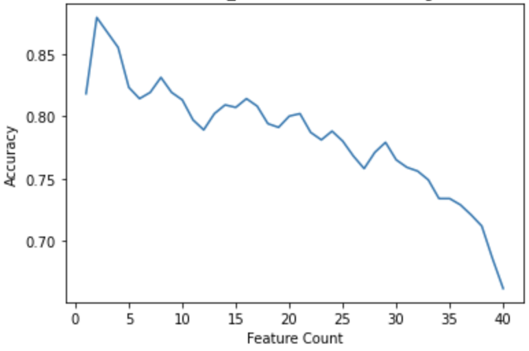

## Dataset Details

We have been assigned two datasets: among them one contains 10 features with 300 instances, and the larger one consists 
of 40 features with 1000 instances. Using panda library, the datasets were read in the program.

## Experimentation Details
## Selected features

Nearest neighbor algorithm is applied on the given datasets. In this project, to classify an instance, 
the closest neighbor is considered, which is 1 nearest neighbor. To validate the accuracy, 
we find that leave- one-out validation results in better performance as opposed to using 10-fold cross validation. 
The project guideline provides one large and one small dataset. It is found that in case of small dataset, 
if leave-one-out validation is used, both forward selection and backward elimination provide the same accuracy and 
select the same set of significant features. On the otherhand, 10-fold cross validation is used, though in case of forward selection, 
it selects the same feature set as the leave-one-out, the accuracy drops to 86%. Due to resource constraints, 
10-fold cross validation is used for the large dataset. 
From the Table 1, it is evident that 10-fold cross validation for forward selection method shows accuracy near to 90%, 
backward elimination derives accuracy 80.8% with a quite bigger feature set. Both Figure 1 and Figure 2 show that in a huge feature space, most of the features are unnecessary and redundant. 
The more redundant features are used, the less accuracy can be achieved.

  
  

  
  

## Computational effort for search

All the experiments are carried out in MacBook Pro with 16 GB of RAM in the Jupyter notebook. Due to resource constraints, for small dataset, both 10-fold and leave-one-out cross validation are used, but in case of large dataset only 10-fold cross validation is used. Table 2 shows that for backward elimination, the execution time is quite larger than forward selection.

## Usage of Cache

Since the execution time for the dataset containing large number of features gets increased exponentially, a cache is used to store the euclidean distance between two features. It reduces the execution time to a great extent.

